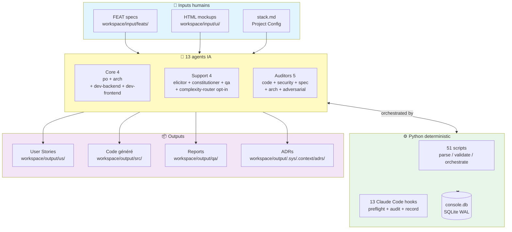
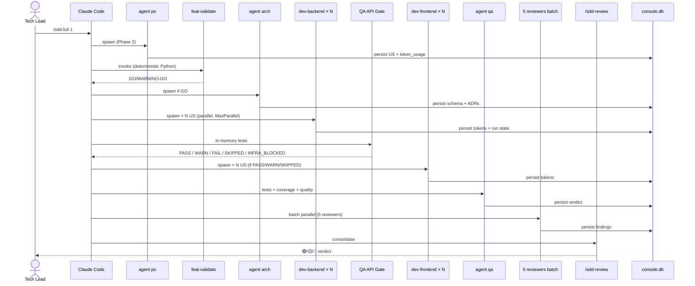
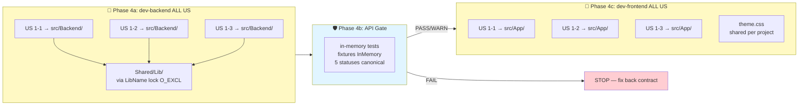

# SDD_Pro — Architecture (référence)

> Document de référence chargé **à la demande** (`Read @.claude/docs/architecture.md`).
> Pas en system prompt.

## 0. Big picture (mermaid)

### 0.1 Composants du framework

### 0.2 Pipeline phase flow (1 FEAT, end-to-end)

### 0.3 Concurrency model (dev-* in parallel)

**Concurrence garanties** :
- LibName lock (`O_EXCL` atomic + stale recovery TOCTOU-safe) sérialise les écritures sur `src/Lib*/`
- `atomic_write` (POSIX `os.replace` + Windows retry 5×50ms) garantit l'intégrité fichier
- ADR filename (`mint_adr_filename` avec `secrets.token_hex(2)` systématique) évite collisions parallèles
- API Gate sépare strictement back → front (workflow gated)
- `MaxParallel` limite le concurrent (défaut 3, range 1-12)

## 1. Vision

Le PO humain rédige une FEAT fonctionnelle. L'UX Designer (humain) dépose
des **mockups HTML statiques** dans `workspace/input/ui/`. Une chaîne de
**13 agents** spécialisés (4 cœur : PO, Arch, Dev-Backend, Dev-Frontend ;
4 support : Elicitor, Constitutioner, QA, Complexity-Router opt-in v7.0.0+ ;
5 auditors : Code-Reviewer, Security-Reviewer, Spec-Compliance-Reviewer,
Arch-Reviewer, Adversarial-Reviewer) transforme l'ensemble en :

1. **User Stories structurées** (1 à 6 par FEAT, cible 1-3) — agent PO
2. **Bootstrap solution + projets vides + (si DB) schéma + entities
   scaffoldées** — agent Arch (idempotent, READ-ONLY sur la base)
3. **Code serveur** — agent Dev-Backend (planifie inline depuis l'US)
4. **Code client** — agent Dev-Frontend (planifie inline depuis l'US +
   HTML mockup + stack UI)

Le bootstrap + scaffolding DB est exécuté UNE FOIS par projet. Le code
est ensuite généré en parallèle par Dev-Backend et Dev-Frontend.

## 2. Modèles assignés par agent

| Agent          | Modèle              | Justification                                       |
|----------------|---------------------|-----------------------------------------------------|
| `po`           | `claude-sonnet-4-6` | Découpage logique, traçabilité — pas de multimodal  |
| `arch`         | `claude-sonnet-4-6` | Init solution + projets vides + introspection DB + scaffolding |
| `dev-backend`  | **`claude-opus-4-7`** | Raisonnement fin sur génération code serveur, `preserves:`/`adds:`, layer mapping |
| `dev-frontend` | **`claude-opus-4-7`** | Raisonnement fin sur génération code client + fidélité HTML→DS |
| ~~`dev-backend-strict` (v6.2)~~ | — | **RETIRÉ v7.0.0** (governance-major-prompts-trim) — variants strict supprimés, plus de routing différencié |
| ~~`dev-frontend-strict` (v6.2)~~ | — | **RETIRÉ v7.0.0** (idem) |
| `elicitor`     | `claude-sonnet-4-6` | Élicitation structurée 5 techniques                 |
| `constitutioner` | `claude-sonnet-4-6` | Sub-agent de `arch` Phase D : crée ADRs + maj constitution §1/§4/§6 + INDEX.md |
| `qa`           | `claude-sonnet-4-6` | Génération tests unitaires                          |
| ~~`dashboard`~~ | — | **RETIRÉ v7.0.0** (governance-major-auditors-trim) → remplacé par `index_adrs.py` (déterministe, 0 token) + console web pour métriques |
| ~~`accessibility-auditor` (v6.3.0)~~ | — | **RETIRÉ v7.0.0** (governance-major-auditors-trim) → remplacé par `axe-core` au CI du projet généré ; schéma `[A11Y_*]` archivé dans `error-classification-legacy.md §1` |
| `code-reviewer` (v6.3.1) | `claude-sonnet-4-6` | Review post-dev cross-fichier : anti-patterns stack, layer violations, contract drift, smells (complémentaire de qa/quality_scan.py) |
| `security-reviewer` (v6.3.2) | `claude-sonnet-4-6` | Mode `scan` (post-dev OWASP Top 10 2021, 21 classes `[SEC_*]`, 8 hard-blocking). Mode `threat-model` retiré v7.0.0 (→ template humain `templates/threat-model.template.md`) |
| ~~`performance-auditor` (v6.4.0)~~ | — | **RETIRÉ v7.0.0** (governance-major-auditors-trim) → remplacé par Lighthouse CI + wrk/k6 au CI du projet généré ; schéma `[PERF_*]` archivé dans `error-classification-legacy.md §2` |

> **Split modèles (v7.0.0)** : Opus 4.7 sur les agents qui génèrent du
> code applicatif (`dev-backend`, `dev-frontend`) — la qualité du code
> généré justifie le coût supplémentaire (preserves/adds contractuels,
> layer mapping strict, fidélité libellés HTML). Sonnet 4.6 sur les
> agents de transformation déterministe et les auditeurs (po, arch,
> elicitor, qa, constitutioner, code-reviewer, security-reviewer,
> spec-compliance-reviewer, arch-reviewer).
>
> **v6.0** : agent `validator` retiré (économie ~1.4M tokens/run).
> `/feat-validate` est désormais 100% déterministe via Python (`validate_readiness.py` + `validate_semantic.py`).
>
> **v7.0.0 retraits** (governance-major-auditors-trim + prompts-trim) :
> `accessibility-auditor` → axe-core CI ; `performance-auditor` →
> Lighthouse CI + wrk/k6 ; `dashboard` → `index_adrs.py` + console web ;
> `dev-*-strict` (forks Sonnet v6.2) supprimés — flag `PlanCacheStrict`
> est désormais DEPRECATED no-op. Le routing `/dev-run` STEP 6.0.bis
> spawn `dev-*` Opus 4.7 que le plan soit v1 ou v2. Design historique
> consultable via `git log -- docs/DESIGN-FROMPLAN-STRICT.md` (fichier
> retiré au sweep v7.0.0-alpha 2026-05-20).

## 3. Agents — lectures et écritures

| Agent          | Lit                                                                  | Écrit                                       |
|----------------|----------------------------------------------------------------------|---------------------------------------------|
| `po`           | `workspace/input/feats/{n}-*.md`, rules, templates                             | `workspace/output/us/{n}-{m}-*.md`                    |
| `arch`         | `workspace/input/stack/stack.md`, stacks actifs (Init Commands §2.2.1, scaffolding §3-§4, connection string §5.1), env vars `DB_*` | `workspace/output/src/...` (projets vides + .sln) ; (si DB) `workspace/output/db/schema.json` + `.md`, entities scaffoldées |
| `dev-backend`  | `workspace/output/us/{n}-{m}-*.md`, `workspace/input/ui/{n}-{m}-*.html` (passif), `workspace/output/src/{BackendName}/CLAUDE.md`, stacks `backend/auth` actifs, `workspace/output/db/schema.json` | `workspace/output/src/{BackendName}/...` (code applicatif) |
| `dev-frontend` | `workspace/output/us/{n}-{m}-*.md`, `workspace/input/ui/{n}-{m}-*.html` (texte direct, source de vérité visuelle), `workspace/output/src/{AppName}/CLAUDE.md`, stacks `frontend/ui` actifs | `workspace/output/src/{AppName}/...` (code applicatif) |
| `qa`           | US + code production (read-only) + ACs                               | `workspace/output/qa/feat-{n}/{report.md, coverage.json, quality.json}` + tests unitaires |
| `constitutioner` | ADRs existants + section §6 constitution.md                        | `workspace/output/.sys/.context/constitution.md` (§1/§4/§6) + `workspace/output/.sys/.context/adrs/INDEX.md` |
| ~~`dashboard`~~ | — | **RETIRÉ v7.0.0** → INDEX.md généré par `index_adrs.py` (déterministe), métriques rendues par console web Fastify |
| ~~`accessibility-auditor` (v6.3.0)~~ | — | **RETIRÉ v7.0.0** → axe-core au CI projet. Schéma `[A11Y_*]` archivé `error-classification-legacy.md §1` |
| `code-reviewer` (v6.3.1) | plan v2 ou fallback convention → code production `src/{BackendName|AppName|LibName}/**` + US passif + Project Config (`CodeReviewMode/FailOn`) + stacks §1.3+§3 actifs + error-classification.md + build-and-loop.md | `workspace/output/.sys/.validation/{n}-code-review.{md,json}` |
| `security-reviewer` (v6.3.2) | mode `scan` uniquement : code production + CLAUDE.md projets + stacks §1.3+§3+§2.4 + plan v2 + `{n}-code-review.json` (dé-dup secrets). Mode `threat-model` retiré v7.0.0 (→ `templates/threat-model.template.md`) | `workspace/output/.sys/.validation/{n}-security-scan.{md,json}` |
| ~~`performance-auditor` (v6.4.0)~~ | — | **RETIRÉ v7.0.0** → Lighthouse CI + wrk/k6 au CI projet. Schéma `[PERF_*]` archivé `error-classification-legacy.md §2` |

**Isolation par famille** : `dev-backend` ne lit jamais les stacks
`frontend/ui` ; il lit l'HTML uniquement de manière passive pour
identifier les endpoints/DTOs déclenchés par les formulaires/tables.
`dev-frontend` ne lit jamais les stacks `backend` hors patterns
d'injection auth.

**Isolation par phase** : `arch` initialise les projets et introspecte
la base **une seule fois**.

**Skip silencieux par famille** : si une US est frontend pure,
`dev-backend` exit avec `skipped (frontend-only US)`. Inversement.

**Contrat DB READ-ONLY** : `arch` n'exécute aucun
`INSERT/UPDATE/DELETE/CREATE/ALTER/DROP/TRUNCATE/EXECUTE` au-delà de
l'introspection des métadonnées.

## 4. Stacks supportés

Sélectionnés par l'humain dans `workspace/input/stack/stack.md` (sections
`## Active …` + `## Active App Type` v6.7.5+).

### 4.0 Active App Type (v6.7.5+)

Le bloc `## Active App Type` du `stack.md` déclare la **topologie projet** :

| AppType | Modèle | Stacks attendus |
|---|---|---|
| `back-front` (défaut) | Backend séparé + Frontend séparé + UI DS | `backend/*` + `frontend/*` + `ui/*` |
| `fullstack` | Projet unique single-process (UI + API + auth intégrés) | `fullstack/*` |
| `mobile-react-native` | Mobile cross-platform (backend distant séparé) | `mobiles/react-native.md` [+ backend distant `backend/*`] |
| `mobile-maui` | Mobile cross-platform .NET MAUI (backend distant séparé) | `mobiles/maui.md` [+ backend distant `backend/*`] |

Validation déterministe par `preflight.py` au démarrage de chaque agent dev-*. Cohérence `AppType ↔ ## Active Tech Specs` vérifiée :
- `AppType=fullstack` SANS stack fullstack/* → `STACK_NOT_SELECTED`
- `AppType=mobile-react-native` SANS `mobiles/react-native.md` → `STACK_NOT_SELECTED`
- Etc.

**Backend** (1 actif requis pour US à composante backend) :
- `backend/dotnet-minimalapi.md` — .NET 10 Minimal API + EF Core + AutoMapper + Serilog + FluentValidation + Polly
- `backend/node-express.md` — Node.js 22 + Express + Prisma
- `backend/python-fastapi.md` — FastAPI 0.115 + SQLAlchemy 2.x async
- `backend/kotlin-spring-boot.md` — Spring Boot 4.0 + Kotlin 2.3 + JPA + MockK

Capabilities **on-demand** (§2.4.b) : EPPlus/ClosedXML (excel),
QuestPDF/iText7 (pdf), MediatR (cqrs), StackExchange.Redis (redis-cache),
Mapster (fast-mapping), Apache POI (excel Java), iText (pdf Java),
ExcelJS (excel Node), PDFKit (pdf Node), openpyxl (excel Python),
reportlab (pdf Python).

**Frontend** (1 actif requis pour US à composante frontend, AppType=`back-front`) :
- `frontend/blazor-webassembly.md`, `frontend/react.md`,
  `frontend/vue.md`, `frontend/angular.md`

**Fullstack** 🟡 expérimental — chargeables mais aucun combo `fullstack`
validé bout-en-bout. Single-project SSR (exclusif d'un combo `backend × frontend`).
Pour stabilité maximale, préférer `back-front` :
- `fullstack/node-react.md` — Fastify 5 + React 18 CDN (modèle workspace/console)
- `fullstack/blazor-server.md` — Blazor Server .NET 10 + SignalR + Razor
- `fullstack/next.md` — Next.js 15 + App Router + RSC + Tailwind v4
- `fullstack/nuxt.md` — Nuxt 3 + Nitro + Vuetify + Pinia
- `fullstack/angular-universal.md` — Angular 19 + @angular/ssr
- `fullstack/kotlin-mustache.md` — Spring Boot + Kotlin + Mustache + HTMX/Alpine.js

**Mobiles** 🟡 expérimental — chargeables mais aucun combo `mobile`
validé bout-en-bout. Mobile cross-platform avec backend distant séparé :
- `mobiles/react-native.md` — Expo SDK 52 + RN 0.76 + Expo Router + NativeWind + Zustand
- `mobiles/maui.md` — .NET MAUI 9 + CommunityToolkit.Mvvm + CommunityToolkit.Maui + sqlite-net-pcl + Refit

**UI Design System** (1 actif requis quand mockup HTML présent) :
- `ui/radzen-blazor.md`, `ui/shadcn.md`, `ui/vuetify.md`

> Chaque stack UI déclare en **§2 Mapping fonctionnel → composant DS**
> ET **§7 Mapping HTML → composant DS (v4)** comment traduire les
> primitives HTML brutes (`<table>`, `<button>`, `<select>`, etc.) vers
> les composants natifs.

**Auth** (optionnel) :
- `auth/azure-ad.md`, `auth/auth-local.md`

**QA** (optionnel) — actif si `## Active QA Specs` non vide :
- `qa/dotnet-xunit.md` — xUnit + Coverlet (.NET backend)
- `qa/blazor-bunit.md` — bUnit + xUnit (Blazor frontend)
- `qa/node-vitest.md` — Vitest + RTL/Vue Test Utils
- `qa/python-pytest.md` — pytest + coverage.py
- `qa/kotlin-junit.md` — JUnit 5 + MockK + JaCoCo
- `qa/angular-jasmine.md` — Jasmine + Karma + istanbul
- `qa/code-quality.md` — sonar-like cross-stack (Python, déterministe)

## 5. État du framework — couvert / hors scope

✅ **Couvert** :
- Phase 1 (FEAT) — interactive, 6 questions max + bootstrap constitution
- Phase 1.5 (élicitation) — `/feat-deepen` agent `elicitor`, 5 techniques
- Phase 2 (US) — découpage 1 à 6 (cible 1-3, warning 4-6) + traçabilité 100%
- Phase 2.5 (HTML mockups) — humain dépose `workspace/input/ui/*.html`
- Phase 2.6 (readiness gate) — `/feat-validate {n}` 🟢 GO / 🟡 WARN / 🔴 NO-GO
- Phase 3 (ARCH + DB) — bootstrap idempotent + scaffolding Database-First + ADRs
- Phase 4 (CODE) — Dev-Backend + Dev-Frontend, plan inline, build loop max 3
- Phase 5 (QA + Quality) — tests unitaires + coverage + quality scan sonar-like
- Phase 5.5 (Accessibility, v6.3.0 → retirée v7.0.0) — `accessibility-auditor` (Haiku) supprimé via ADR `governance-major-auditors-trim`. Remplacement v7.2.0 : ingest CI déterministe `sdd_scripts/ingest_axe.py` (axe-core JSON → `qa_a11y`), verdict 🟢/🟡/🔴 selon `A11yFailOn`. Cf. `rules/error-classification-legacy.md §1`.
- Phase 6.4 (Code Review, v6.3.1) — review cross-fichier post-dev via `code-reviewer` (Sonnet) — anti-patterns stack, layer violations, contract drift, smells. Hard-blocking sur `[FRONTEND_BACKEND_CONTRACT_GAP]` (audit 2026-06-05 : `[REVIEW_SECRETS_HARDCODED]` retiré du hard-blocking code-reviewer — ownership transféré à `security-reviewer` via `[SEC_SECRET_HARDCODED]`).
- Phase 3.5 + 6.5 (Security Review, v6.3.2) — `security-reviewer` (Sonnet) 2 modes : pré-dev threat model STRIDE (informational) + post-dev scan OWASP Top 10 (verdict 🟢/🟡/🔴, 8 classes hard-blocking).
- Phase 7 (Performance Audit, v6.4.0 → retirée v7.0.0) — `performance-auditor` (Sonnet) supprimé via ADR `governance-major-auditors-trim`. Remplacement v7.2.0 : ingest CI déterministe `sdd_scripts/ingest_lighthouse.py` (Lighthouse JSON → `qa_performance`), verdict selon `PerfFailOn`. SLO API backend (wrk/k6) prévu v7.3+. Cf. `rules/error-classification-legacy.md §2`.
- Templates ops (v6.4.0) — `templates/{runbook,postmortem,slo-sli}.template.md` à instancier par le Tech Lead lors de la mise en prod du projet généré.
- Phase planner (v6.4.1) — script Python déterministe `phase_planner.py` qui décide quelles phases auditor sont enabled/skipped selon Project Config + stacks actifs + état runtime + mentions perf/sec dans ACs. Invoqué par `/sdd-full` STEP 1.quart (récap unifié au démarrage, non bloquant ; renommé depuis 1.tiers lors de l'audit P0-workflow 2026-06-05). Détection automatique override pour ACs explicites (`LCP < 2s` force perf-audit même en mode manual).
- Auto-invoke chain (v6.4.2) — branchement effectif des 5 agents auditor dans le pipeline. `/dev-run` STEP 5.5 (threat-model post-arch) + STEP 6.4 (3 agents en parallèle pré-dashboard : code-review + a11y + security-scan). `/qa-generate` STEP 6.4 (perf-audit post-coverage). Verdict 🔴 RED de code-reviewer/a11y/security-scan → STOP avec rapport et procédure de déblocage.

❌ **Hors scope** :
- DevOps / CI / déploiement (templates ops fournis mais pas d'auto-gen pipeline)
- Migrations EF Core forward/rollback
- Dashboard / observabilité production runtime
- E2E tests (out-of-process Playwright/Cypress — non couvert)
- CVE deps scanning runtime (couvert partiellement par `library-and-stack.md §0` post-install par arch)
- Backend dynamic benchmarking via wrk/k6 (prévu v6.4.0.1 via `perf_bench.py`)
- ~~Enrichissement `dashboard` pour absorber les 6 nouveaux JSON auditor dans `README.html`~~ **OBSOLÈTE v6.10** : les auditors persistent désormais dans `console.db` (tables `qa_code_review`, `qa_security`, `qa_perf`, `qa_a11y`, `qa_spec_compliance`) ; le rendu graphique est délégué à la console web (`workspace/console/`) ou consommateur externe
- Script `perf_bench.py` pour benchmark backend dynamique via wrk/k6 (prévu v6.4.0.1)
